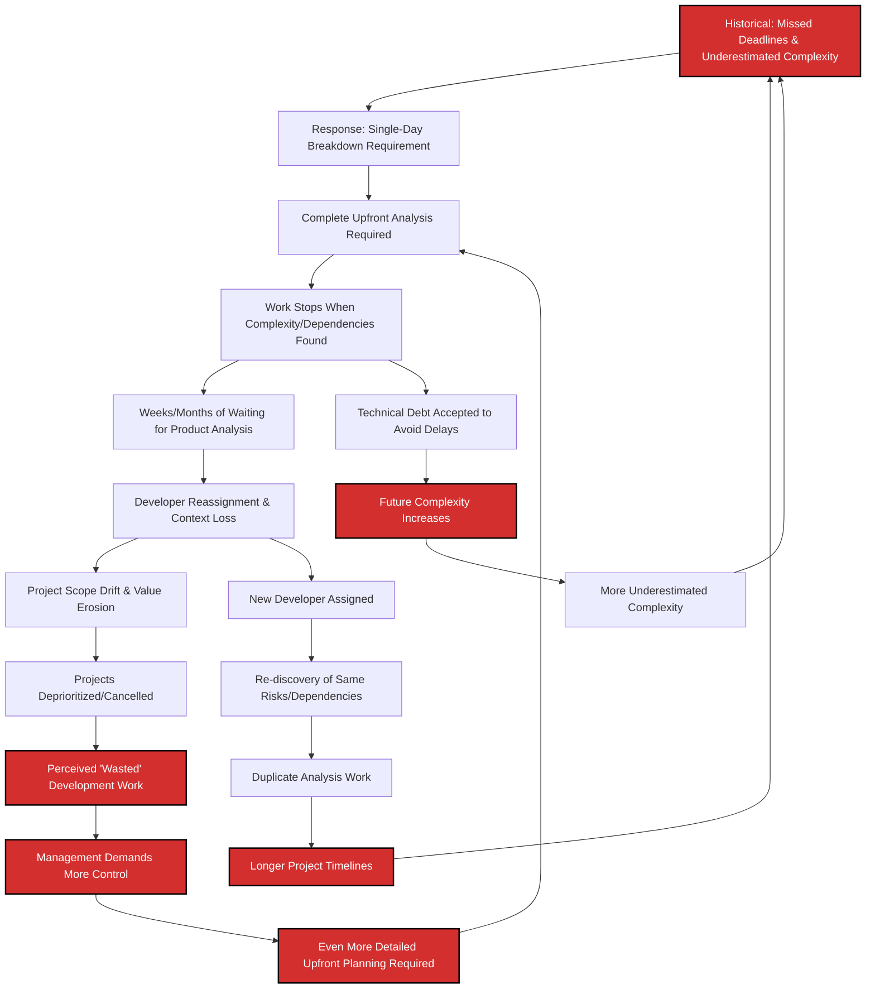
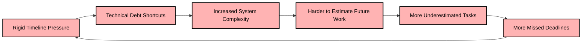
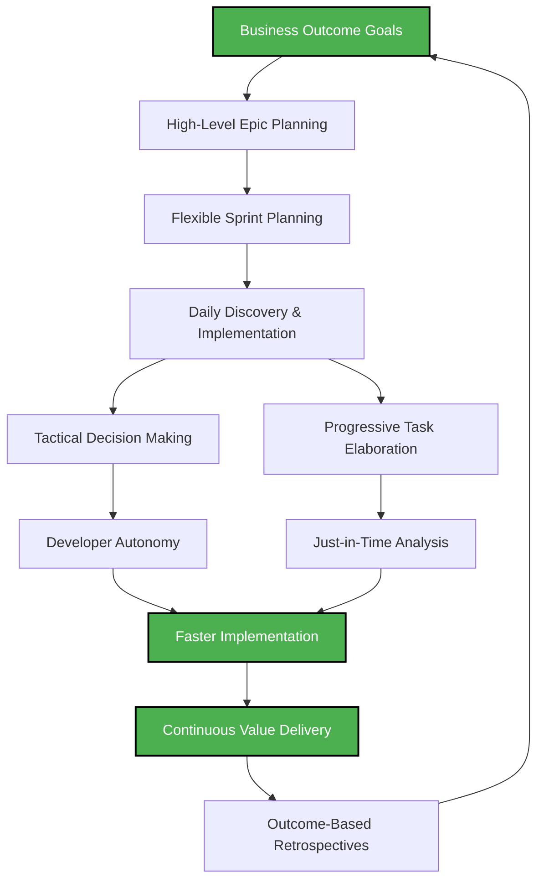
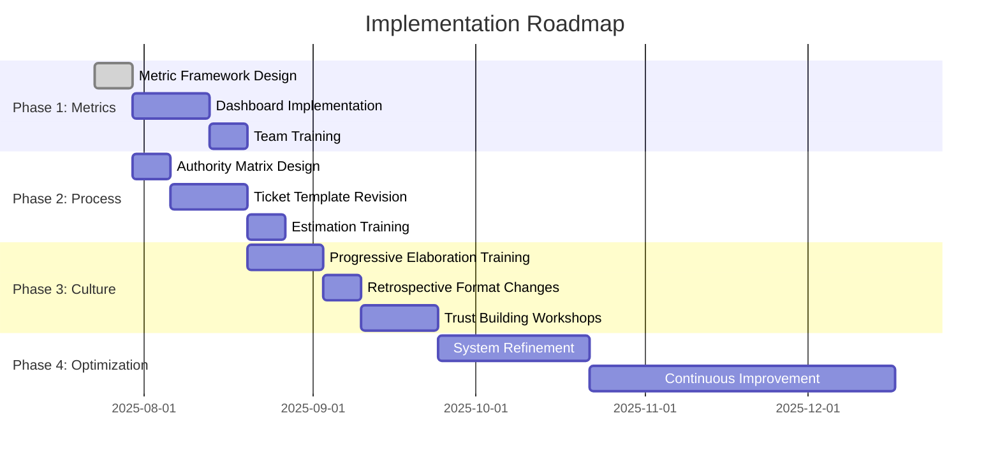

# Task Breakdown System Analysis: Moving Beyond Micromanagement

## Problem Statement

Our current software development process requires every ticket to be broken down into single-day work units, ostensibly to enable ticket count as a success metric. This system creates a cascade of dysfunction that fundamentally undermines our ability to deliver value effectively:

1. **Misaligned Metrics**: Using ticket count as a success measure divorces our work from actual business outcomes
2. **Administrative Overhead**: Each granular ticket requires extensive metadata (assignee, description, testing instructions, analysis results, resolution details, components affected, etc.)
3. **Innovation Bottleneck**: The requirement for complete upfront knowledge prevents teams from beginning work until all unknowns are resolved
4. **Product Team Overload**: Excessive granularity forces product teams into tactical details rather than strategic vision
5. **Timeline Fragility**: Rigid estimation with no flexibility makes deadlines extremely brittle when unknowns emerge

## System Analysis

### Root Cause: The Control Paradox

The system was designed to solve **missed deadlines** and **underestimated complexity**, but creates the very problems it seeks to prevent through a cascade of unintended consequences.

### Deep Causal Structure

### The Three Vicious Cycles

**Cycle 1: The Control Spiral**
- More control → More delays → More perceived waste → Demands for even more control

**Cycle 2: The Technical Debt Trap** 
- Rigid timelines → Technical debt shortcuts → Increased complexity → More estimation errors

**Cycle 3: The Context Loss Loop**
- Detailed planning → Work stoppages → Reassignment → Lost context → Re-analysis → Longer timelines

### System Entities and Relationships

#### Stocks (Accumulated Resources)
- **Administrative Burden**: Accumulated overhead of detailed ticket management and metadata
  - *Side Effects*: Reduces time available for actual development work
  - *Measured by*: Hours spent on ticket creation, updates, and tracking per sprint

- **Context Loss Inventory**: Accumulated knowledge gaps from developer reassignments
  - *Side Effects*: Duplicate analysis work, longer ramp-up times, missed edge cases
  - *Measured by*: Number of reassignments, time to productivity after reassignment

- **Technical Debt**: Suboptimal solutions implemented due to rigid timeline constraints
  - *Side Effects*: Increased future complexity, harder estimation, system fragility
  - *Measured by*: Code complexity metrics, bug rates, refactoring time required

- **Product Strategy Deficit**: Backlog of strategic decisions deferred due to tactical focus
  - *Side Effects*: Misaligned features, competitive disadvantage, unclear product vision
  - *Measured by*: Time product team spends on tactical vs strategic decisions

- **Team Burnout**: Accumulated frustration from inefficient processes and overtime
  - *Side Effects*: Reduced creativity, higher turnover, quality degradation
  - *Measured by*: Employee satisfaction scores, turnover rates, sick days

#### Flows (Rates of Change)
- **Work Intake Rate**: New requirements entering the system
  - *Current State*: Constrained by breakdown requirements
  - *Side Effect*: Innovation projects rejected due to uncertainty

- **Analysis Overhead Rate**: Time spent on pre-work breakdown and re-analysis
  - *Current State*: 30-40% of development time spent on analysis
  - *Side Effect*: Reduced actual development velocity

- **Context Switching Rate**: Frequency of moving between granular tasks and projects
  - *Current State*: High due to reassignments during analysis delays
  - *Side Effect*: Cognitive overhead, reduced deep work time

- **Strategic Decision Rate**: Speed of high-level product and technical decisions
  - *Current State*: Slowed by tactical overload
  - *Side Effect*: Market opportunities missed, competitive lag

- **Value Delivery Rate**: Business outcomes delivered to customers
  - *Current State*: Reduced due to system inefficiencies
  - *Side Effect*: Customer dissatisfaction, revenue impact

#### Key System Relationships and Side Effects

**Relationship 1: Administrative Burden ↔ Development Velocity**
- *Causal Link*: More detailed breakdown requirements → More administrative overhead → Less development time
- *Side Effects*: Developers become ticket administrators, reducing coding time by 20-30%

**Relationship 2: Context Loss ↔ Project Timeline**
- *Causal Link*: Work stoppages → Developer reassignment → Context loss → Re-analysis required
- *Side Effects*: Projects take 40-60% longer than original estimates due to knowledge reconstruction

**Relationship 3: Technical Debt ↔ Estimation Accuracy**
- *Causal Link*: Rigid timelines → Technical shortcuts → Increased complexity → Harder to estimate
- *Side Effects*: Estimation accuracy degrades over time, creating more missed deadlines

**Relationship 4: Control Measures ↔ Innovation Capacity**
- *Causal Link*: More control requirements → Higher barriers to uncertain work → Innovation suppressed
- *Side Effects*: Organization becomes less competitive, loses market opportunities

#### Detailed Feedback Loop Analysis

**Reinforcing Loop R1: The Control Death Spiral**

```mermaid
graph LR
    A[Missed Deadlines] --> B[Demand for More Control]
    B --> C[More Detailed Upfront Planning]
    C --> D[Work Stoppages for Analysis]
    D --> E[Context Loss & Reassignment]
    E --> F[Project Delays & Cancellations]
    F --> G[Perceived Development Failure]
    G --> A
    
    style A fill:#ffb3b3,stroke:#000,stroke-width:2px,color:#000
    style B fill:#ffb3b3,stroke:#000,stroke-width:2px,color:#000
    style C fill:#ffb3b3,stroke:#000,stroke-width:2px,color:#000
    style D fill:#ffb3b3,stroke:#000,stroke-width:2px,color:#000
    style E fill:#ffb3b3,stroke:#000,stroke-width:2px,color:#000
    style F fill:#ffb3b3,stroke:#000,stroke-width:2px,color:#000
    style G fill:#ffb3b3,stroke:#000,stroke-width:2px,color:#000
```

*Delay: 3-6 months between control implementation and deadline impact*

**Reinforcing Loop R2: The Technical Debt Acceleration**

*Delay: 6-12 months for technical debt to compound*

**Reinforcing Loop R3: The Context Hemorrhage Cycle**

```mermaid
graph LR
    A[Detailed Task Breakdown Required] --> B[Complexity/Dependencies Discovered]
    B --> C[Work Stops for Product Analysis]
    C --> D[Developer Reassignment]
    D --> E[Context & Domain Knowledge Lost]
    E --> F[Re-analysis Required When Resumed]
    F --> G[Same Dependencies Re-discovered]
    G --> A
    
    style A fill:#ffb3b3,stroke:#000,stroke-width:2px,color:#000
    style B fill:#ffb3b3,stroke:#000,stroke-width:2px,color:#000
    style C fill:#ffb3b3,stroke:#000,stroke-width:2px,color:#000
    style D fill:#ffb3b3,stroke:#000,stroke-width:2px,color:#000
    style E fill:#ffb3b3,stroke:#000,stroke-width:2px,color:#000
    style F fill:#ffb3b3,stroke:#000,stroke-width:2px,color:#000
    style G fill:#ffb3b3,stroke:#000,stroke-width:2px,color:#000
```

*Delay: 2-8 weeks between reassignment and return to task*

**Balancing Loop B1: The Innovation Suppressor**

```mermaid
graph LR
    A[Innovative Project Ideas] --> B[High Uncertainty & Risk]
    B --> C[Cannot Meet Detailed Breakdown Requirements]
    C --> D[Projects Rejected or Simplified]
    D --> E[Reduced Innovation Portfolio]
    E --> F[Lower Competitive Advantage]
    F --> G[Pressure for More Innovation]
    G --> A
    
    style A fill:#b3ffb3,stroke:#000,stroke-width:2px,color:#000
    style B fill:#b3ffb3,stroke:#000,stroke-width:2px,color:#000
    style C fill:#b3ffb3,stroke:#000,stroke-width:2px,color:#000
    style D fill:#b3ffb3,stroke:#000,stroke-width:2px,color:#000
    style E fill:#b3ffb3,stroke:#000,stroke-width:2px,color:#000
    style F fill:#b3ffb3,stroke:#000,stroke-width:2px,color:#000
    style G fill:#b3ffb3,stroke:#000,stroke-width:2px,color:#000
```

*This balancing loop prevents innovation by design*

### Current System Problems by Work Type

| Work Type | Current System Effectiveness | Issues |
|-----------|----------------------------|---------|
| Large Bug Backlogs | ✅ Good | Well-defined, predictable work |
| Kanban Maintenance | ✅ Good | Reactive, bounded scope |
| Sprint Development | ❌ Poor | Innovation requires flexibility |
| Project Work | ❌ Poor | Unknown unknowns common |
| Scrum Implementation | ❌ Poor | Iterative discovery hindered |

## Systems Thinking: Root Cause Analysis

### System Archetypes Present

**Archetype 1: "Fixes that Fail"**
- *Quick Fix*: Single-day breakdown requirements to prevent missed deadlines
- *Unintended Consequence*: Creates more delays through work stoppages and context loss
- *Long-term Impact*: Makes the original problem (missed deadlines) worse over time

**Archetype 2: "Limits to Growth"**
- *Growth Engine*: Detailed planning and control measures
- *Limiting Factor*: Product team capacity and developer context retention
- *Result*: System performance degrades as control measures increase

**Archetype 3: "Shifting the Burden"**
- *Symptom*: Missed deadlines and estimation errors
- *Quick Fix*: More detailed upfront planning
- *Fundamental Solution*: Building adaptive capacity and trust-based systems
- *Addiction*: Organization becomes dependent on control measures, losing ability to handle uncertainty

### The Trust Deficit
The core issue is a **trust deficit** manifesting in two dimensions:

1. **Trust in Estimation Flexibility**: Fear that without rigid breakdown, deadlines become meaningless
2. **Trust in Developer Judgment**: Belief that developers cannot make appropriate tactical decisions

### Intervention Points and Leverage

Using Donella Meadows' leverage points framework, ordered by effectiveness:

**Highest Leverage (Paradigm Level) - Change the Mindset**
- **Shift Mental Model**: From "Control prevents problems" to "Adaptability solves problems"
- **Reframe Success**: From "Following the plan" to "Achieving outcomes"
- **Transform Trust**: From "Trust but verify everything" to "Trust and verify outcomes"

**High Leverage (Goals Level) - Change the Purpose**
- **Metric Revolution**: Replace ticket count with business value delivered
- **Outcome Focus**: Measure customer impact, not process compliance
- **Innovation Metrics**: Track learning velocity, not just delivery velocity

**Medium Leverage (Structure Level) - Change the Rules**
- **Decision Rights**: Distribute tactical authority to development teams
- **Estimation Flexibility**: Allow ranges and confidence intervals
- **Work-in-Progress Limits**: Prevent context switching through WIP caps
- **Feedback Loops**: Create rapid outcome-based retrospectives

**Lower Leverage (Parameter Level) - Change the Numbers**
- **Reduce Metadata**: Cut required ticket fields by 60%
- **Increase Task Size**: Allow multi-day work units
- **Extend Planning Horizons**: Move from daily to weekly planning cycles

### Critical Intervention Sequence

**Phase 1: Break the Control Death Spiral (Weeks 1-4)**
1. **Immediate**: Stop requiring single-day breakdowns for innovation work
2. **Establish**: Outcome-based success metrics alongside existing metrics
3. **Create**: "Innovation track" with different rules for uncertain work

**Phase 2: Build Adaptive Capacity (Weeks 5-12)**
1. **Implement**: Range-based estimation with confidence intervals
2. **Train**: Teams on progressive elaboration and just-in-time analysis
3. **Establish**: Decision authority matrix to reduce bottlenecks

**Phase 3: Cultural Transformation (Weeks 13-24)**
1. **Shift**: From control-based to trust-based management
2. **Measure**: Learning velocity and adaptation speed
3. **Reward**: Outcome achievement over process compliance

### Leverage Points for Change

**High Leverage (Paradigm Level)**
- Shift from ticket count to outcome-based metrics
- Move from risk avoidance to risk management
- Transform from command-and-control to trust-and-verify

**Medium Leverage (Structure Level)**
- Implement flexible estimation ranges
- Create decision-making authority matrices
- Establish outcome-focused retrospectives

**Low Leverage (Parameter Level)**
- Reduce required ticket metadata
- Increase maximum task size limits

## Proposed Solution: Flexible Task Management System

### Core Principles

1. **Outcome-Driven Metrics**: Measure success by business value delivered, not ticket volume
2. **Flexible Estimation**: Allow estimation ranges that accommodate discovery and learning
3. **Distributed Decision Making**: Empower development teams to make tactical decisions within strategic boundaries
4. **Progressive Elaboration**: Start work with high-level understanding, elaborate details during implementation

### New System Design

### Implementation Framework

#### Phase 1: Metric Transformation (Weeks 1-4)
- **Replace**: Ticket count metrics → Business outcome metrics
- **Implement**: Story point velocity with confidence intervals
- **Establish**: Value delivery tracking dashboard

#### Phase 2: Process Flexibility (Weeks 5-8)
- **Introduce**: Estimation ranges (e.g., "3-5 days" instead of "1 day")
- **Reduce**: Required ticket metadata by 60%
- **Create**: Decision authority matrix for different team levels

#### Phase 3: Cultural Shift (Weeks 9-16)
- **Train**: Teams on progressive elaboration techniques
- **Implement**: Outcome-focused retrospectives
- **Establish**: Trust-building feedback loops

### Decision Authority Matrix

| Decision Type | Junior Dev | Senior Dev | Tech Lead | Product Manager | QA Analyst |
|---------------|------------|------------|-----------|-----------------|------------|
| Button order | ❌ | ✅ | ✅ | ✅ | Consult |
| CSS units (px/rem) | ❌ | ✅ | ✅ | ❌ | ❌ |
| Schema modifications | ❌ | ❌ | ✅ | Consult | Consult |
| Feature scope changes | ❌ | ❌ | Consult | ✅ | Consult |
| Product vision | ❌ | ❌ | ❌ | ✅ | ❌ |
| Quality criteria definition | ❌ | Consult | Consult | Consult | ✅ |
| Acceptance criteria | ❌ | Consult | Consult | ✅ | ✅ |
| Testing strategy | ❌ | Consult | ✅ | ❌ | ✅ |
| Risk assessment | ❌ | Consult | ✅ | Consult | ✅ |

### QA Evolution: From Gatekeeper to Quality Partner

**Current QA Role in Rigid System:**
- **Reactive Testing**: QA receives fully-defined tickets with predetermined acceptance criteria
- **Binary Validation**: Pass/fail testing against rigid specifications
- **End-of-Pipeline**: Quality checks happen after development is "complete"
- **Limited Influence**: QA has little input on quality definitions or risk assessment

**Enhanced QA Role in Flexible System:**
- **Proactive Quality Definition**: QA helps define "done" criteria during progressive elaboration
- **Risk-Based Testing**: Focus testing efforts on highest-risk areas identified during development
- **Continuous Quality Partnership**: Embedded in development process, not just at the end
- **Quality Advocacy**: Represents user experience and system reliability concerns

#### QA's New Responsibilities

**1. Dynamic Quality Criteria Definition**

```mermaid
graph LR
    A[Epic/Story Kickoff] --> B[QA Defines Quality Framework]
    B --> C[Progressive Elaboration]
    C --> D[QA Refines Acceptance Criteria]
    D --> E[Development & Testing]
    E --> F[QA Validates Against Evolved Criteria]
    F --> G[Outcome Assessment]
    
    style B fill:#4caf50,stroke:#000,stroke-width:2px,color:#fff
    style D fill:#4caf50,stroke:#000,stroke-width:2px,color:#fff
    style F fill:#4caf50,stroke:#000,stroke-width:2px,color:#fff
```

**2. Risk-Based Test Strategy**
- **High-Risk Areas**: Focus testing on complex integrations, user-facing features, data integrity
- **Low-Risk Areas**: Automated testing for well-understood functionality
- **Emerging Risks**: Identify new risks as requirements evolve during development

**3. Quality Metrics Evolution**
- **From**: "All test cases passed"
- **To**: "User experience meets quality standards and business outcomes achieved"

#### QA Integration Points in Flexible Process

**Sprint Planning Phase:**
- **QA Input**: Risk assessment of proposed work
- **Quality Framework**: Establish quality criteria for outcomes, not just outputs
- **Testing Strategy**: Define approach based on uncertainty level and business impact

**Daily Development:**
- **Continuous Consultation**: Available for quality questions as requirements evolve
- **Progressive Testing**: Test emerging functionality against evolving criteria
- **Risk Monitoring**: Flag quality concerns as they emerge

**Outcome Validation:**
- **Business Impact Testing**: Validate that outcomes meet business goals
- **User Experience Validation**: Ensure quality from user perspective
- **System Reliability**: Confirm technical quality standards maintained

#### Quality Criteria Framework

**Outcome-Based Quality Metrics:**
1. **User Experience Quality**
   - Task completion rates
   - User satisfaction scores
   - Error recovery effectiveness

2. **Business Impact Quality**
   - Feature adoption rates
   - Performance against business KPIs
   - Customer support ticket reduction

3. **Technical Quality**
   - System performance under load
   - Integration reliability
   - Maintainability metrics

4. **Process Quality**
   - Time to identify and fix issues
   - Deployment success rates
   - Rollback frequency

#### QA Tools and Techniques for Flexible Requirements

**Progressive Acceptance Criteria:**
- **Initial Framework**: High-level quality expectations
- **Iterative Refinement**: Criteria evolve as understanding deepens
- **Outcome Validation**: Final criteria focus on business and user outcomes

**Risk-Based Testing Matrix:**
| Risk Level | Testing Approach | QA Involvement | Automation Level |
|------------|------------------|----------------|------------------|
| High | Comprehensive manual + automated | Deep partnership | Medium |
| Medium | Targeted testing on key paths | Regular consultation | High |
| Low | Primarily automated | Minimal oversight | Very High |

**Quality Gates for Flexible Development:**
1. **Quality Framework Gate**: Are quality criteria defined for the outcome?
2. **Risk Assessment Gate**: Are major risks identified and testing planned?
3. **Progressive Validation Gate**: Is quality being validated throughout development?
4. **Outcome Achievement Gate**: Does the result meet business and user quality standards?

#### Addressing QA Concerns About Looser Requirements

**Concern**: "How can we test effectively without detailed specifications?"
**Solution**: 
- Shift from specification testing to outcome testing
- Use exploratory testing techniques for uncertain areas
- Develop quality criteria collaboratively as understanding emerges

**Concern**: "Quality might suffer with less upfront planning"
**Solution**:
- Implement continuous quality validation instead of end-stage testing
- Focus testing efforts on highest-risk, highest-impact areas
- Use quality metrics that measure actual user and business outcomes

**Concern**: "How do we maintain consistency across features?"
**Solution**:
- Establish quality frameworks and patterns that can be applied flexibly
- Create reusable quality criteria templates for common scenarios
- Maintain quality standards documentation that evolves with the product

#### QA Success Metrics in New System

**Leading Indicators:**
- Time from quality issue identification to resolution
- Percentage of quality criteria defined collaboratively vs. imposed
- QA involvement in early-stage requirement discussions

**Lagging Indicators:**
- User-reported quality issues (should decrease)
- Business outcome achievement rates (should increase)
- Customer satisfaction with delivered features (should improve)

## How This Addresses Current Problems

### 1. Misaligned Metrics → Outcome Focus
**Current**: "We completed 47 tickets this sprint"
**Proposed**: "We delivered the user onboarding flow, reducing time-to-value by 40%"

### 2. Administrative Overhead → Streamlined Process
**Current**: 8-10 required fields per ticket
**Proposed**: 3-4 essential fields, with optional elaboration

### 3. Innovation Bottleneck → Discovery-Driven Development
**Current**: Must know everything before starting
**Proposed**: Start with clear outcomes, discover implementation details

### 4. Product Team Overload → Strategic Focus Liberation
**Current**: Product team answering "What order should these buttons be in?"
**Proposed**: Product team focusing on "What workflows provide customer value?"

### 5. Timeline Fragility → Adaptive Planning
**Current**: Rigid 1-day estimates that break with any unknown
**Proposed**: Flexible ranges that accommodate learning and discovery

## Risk Mitigation

### Potential Concerns and Responses

**Concern**: "Without detailed breakdown, we'll lose track of progress"
**Response**: Implement daily outcome check-ins and continuous integration practices

**Concern**: "Junior developers need more structure"
**Response**: Maintain structured approach for junior team members while allowing flexibility for senior staff

**Concern**: "Estimation will become meaningless"
**Response**: Range-based estimation with confidence intervals provides more accurate and honest forecasting

## Success Metrics

### Leading Indicators
- Reduction in pre-work analysis time
- Increase in product team strategic planning time
- Improvement in developer satisfaction scores

### Lagging Indicators
- Faster time-to-market for new features
- Improved customer satisfaction with delivered solutions
- Reduced technical debt accumulation

## Implementation Timeline

## Conclusion

The current task breakdown system, while well-intentioned, creates systemic dysfunction that prevents our team from delivering maximum value. By shifting to an outcome-focused, trust-based system with flexible estimation and distributed decision-making, we can:

- Liberate product teams to focus on strategic vision
- Enable development teams to begin work and learn during implementation
- Create more accurate and honest project timelines
- Reduce administrative overhead while maintaining accountability
- Scale our processes to handle innovation and project work effectively

This transformation requires courage to move from control to trust, but the benefits—increased velocity, better outcomes, and improved team satisfaction—make it essential for our continued success.

---

*This analysis uses systems thinking to identify root causes and leverage points for sustainable change in our development process.*
