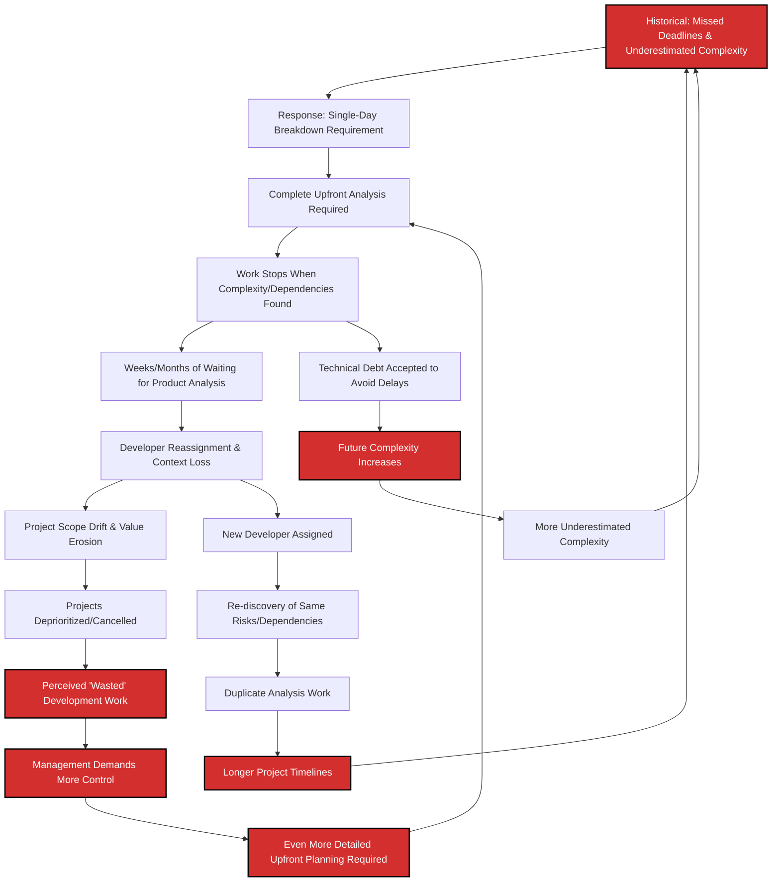
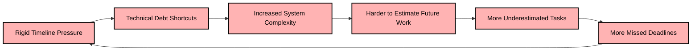

# System Dynamics Analysis: Deep Dive into Root Causes

## The Control Paradox: How Solutions Become Problems

The system was designed to solve **missed deadlines** and **underestimated complexity**, but creates the very problems it seeks to prevent through a cascade of unintended consequences.

## Deep Causal Structure

## System Entities and Relationships

### Stocks (Accumulated Resources)

**Administrative Burden**: Accumulated overhead of detailed ticket management and metadata
- *Side Effects*: Reduces time available for actual development work
- *Measured by*: Hours spent on ticket creation, updates, and tracking per sprint

**Context Loss Inventory**: Accumulated knowledge gaps from developer reassignments
- *Side Effects*: Duplicate analysis work, longer ramp-up times, missed edge cases
- *Measured by*: Number of reassignments, time to productivity after reassignment

**Technical Debt**: Suboptimal solutions implemented due to rigid timeline constraints
- *Side Effects*: Increased future complexity, harder estimation, system fragility
- *Measured by*: Code complexity metrics, bug rates, refactoring time required

**Product Strategy Deficit**: Backlog of strategic decisions deferred due to tactical focus
- *Side Effects*: Misaligned features, competitive disadvantage, unclear product vision
- *Measured by*: Time product team spends on tactical vs strategic decisions

**Team Burnout**: Accumulated frustration from inefficient processes and overtime
- *Side Effects*: Reduced creativity, higher turnover, quality degradation
- *Measured by*: Employee satisfaction scores, turnover rates, sick days

### Flows (Rates of Change)

**Work Intake Rate**: New requirements entering the system
- *Current State*: Constrained by breakdown requirements
- *Side Effect*: Innovation projects rejected due to uncertainty

**Analysis Overhead Rate**: Time spent on pre-work breakdown and re-analysis
- *Current State*: 30-40% of development time spent on analysis
- *Side Effect*: Reduced actual development velocity

**Context Switching Rate**: Frequency of moving between granular tasks and projects
- *Current State*: High due to reassignments during analysis delays
- *Side Effect*: Cognitive overhead, reduced deep work time

**Strategic Decision Rate**: Speed of high-level product and technical decisions
- *Current State*: Slowed by tactical overload
- *Side Effect*: Market opportunities missed, competitive lag

**Value Delivery Rate**: Business outcomes delivered to customers
- *Current State*: Reduced due to system inefficiencies
- *Side Effect*: Customer dissatisfaction, revenue impact

## The Three Vicious Cycles

### Reinforcing Loop R1: The Control Death Spiral

```mermaid
graph LR
    A[Missed Deadlines] --> B[Demand for More Control]
    B --> C[More Detailed Upfront Planning]
    C --> D[Work Stoppages for Analysis]
    D --> E[Context Loss & Reassignment]
    E --> F[Project Delays & Cancellations]
    F --> G[Perceived Development Failure]
    G --> A
    
    style A fill:#ffb3b3,stroke:#000,stroke-width:2px,color:#000
    style B fill:#ffb3b3,stroke:#000,stroke-width:2px,color:#000
    style C fill:#ffb3b3,stroke:#000,stroke-width:2px,color:#000
    style D fill:#ffb3b3,stroke:#000,stroke-width:2px,color:#000
    style E fill:#ffb3b3,stroke:#000,stroke-width:2px,color:#000
    style F fill:#ffb3b3,stroke:#000,stroke-width:2px,color:#000
    style G fill:#ffb3b3,stroke:#000,stroke-width:2px,color:#000
```

*Delay: 3-6 months between control implementation and deadline impact*

### Reinforcing Loop R2: The Technical Debt Acceleration

*Delay: 6-12 months for technical debt to compound*

### Reinforcing Loop R3: The Context Hemorrhage Cycle

```mermaid
graph LR
    A[Detailed Task Breakdown Required] --> B[Complexity/Dependencies Discovered]
    B --> C[Work Stops for Product Analysis]
    C --> D[Developer Reassignment]
    D --> E[Context & Domain Knowledge Lost]
    E --> F[Re-analysis Required When Resumed]
    F --> G[Same Dependencies Re-discovered]
    G --> A
    
    style A fill:#ffb3b3,stroke:#000,stroke-width:2px,color:#000
    style B fill:#ffb3b3,stroke:#000,stroke-width:2px,color:#000
    style C fill:#ffb3b3,stroke:#000,stroke-width:2px,color:#000
    style D fill:#ffb3b3,stroke:#000,stroke-width:2px,color:#000
    style E fill:#ffb3b3,stroke:#000,stroke-width:2px,color:#000
    style F fill:#ffb3b3,stroke:#000,stroke-width:2px,color:#000
    style G fill:#ffb3b3,stroke:#000,stroke-width:2px,color:#000
```

*Delay: 2-8 weeks between reassignment and return to task*

### Balancing Loop B1: The Innovation Suppressor

```mermaid
graph LR
    A[Innovative Project Ideas] --> B[High Uncertainty & Risk]
    B --> C[Cannot Meet Detailed Breakdown Requirements]
    C --> D[Projects Rejected or Simplified]
    D --> E[Reduced Innovation Portfolio]
    E --> F[Lower Competitive Advantage]
    F --> G[Pressure for More Innovation]
    G --> A
    
    style A fill:#b3ffb3,stroke:#000,stroke-width:2px,color:#000
    style B fill:#b3ffb3,stroke:#000,stroke-width:2px,color:#000
    style C fill:#b3ffb3,stroke:#000,stroke-width:2px,color:#000
    style D fill:#b3ffb3,stroke:#000,stroke-width:2px,color:#000
    style E fill:#b3ffb3,stroke:#000,stroke-width:2px,color:#000
    style F fill:#b3ffb3,stroke:#000,stroke-width:2px,color:#000
    style G fill:#b3ffb3,stroke:#000,stroke-width:2px,color:#000
```

*This balancing loop prevents innovation by design*

## System Archetypes Present

### Archetype 1: "Fixes that Fail"
- *Quick Fix*: Single-day breakdown requirements to prevent missed deadlines
- *Unintended Consequence*: Creates more delays through work stoppages and context loss
- *Long-term Impact*: Makes the original problem (missed deadlines) worse over time

### Archetype 2: "Limits to Growth"
- *Growth Engine*: Detailed planning and control measures
- *Limiting Factor*: Product team capacity and developer context retention
- *Result*: System performance degrades as control measures increase

### Archetype 3: "Shifting the Burden"
- *Symptom*: Missed deadlines and estimation errors
- *Quick Fix*: More detailed upfront planning
- *Fundamental Solution*: Building adaptive capacity and trust-based systems
- *Addiction*: Organization becomes dependent on control measures, losing ability to handle uncertainty

## The Trust Deficit

The core issue is a **trust deficit** manifesting in two dimensions:

1. **Trust in Estimation Flexibility**: Fear that without rigid breakdown, deadlines become meaningless
2. **Trust in Developer Judgment**: Belief that developers cannot make appropriate tactical decisions

## Current System Problems by Work Type

| Work Type | Current System Effectiveness | Issues |
|-----------|----------------------------|---------|
| Large Bug Backlogs | ✅ Good | Well-defined, predictable work |
| Kanban Maintenance | ✅ Good | Reactive, bounded scope |
| Sprint Development | ❌ Poor | Innovation requires flexibility |
| Project Work | ❌ Poor | Unknown unknowns common |
| Scrum Implementation | ❌ Poor | Iterative discovery hindered |

## Leverage Points for Change

Using Donella Meadows' leverage points framework, ordered by effectiveness:

### Highest Leverage (Paradigm Level) - Change the Mindset
- **Shift Mental Model**: From "Control prevents problems" to "Adaptability solves problems"
- **Reframe Success**: From "Following the plan" to "Achieving outcomes"
- **Transform Trust**: From "Trust but verify everything" to "Trust and verify outcomes"

### High Leverage (Goals Level) - Change the Purpose
- **Metric Revolution**: Replace ticket count with business value delivered
- **Outcome Focus**: Measure customer impact, not process compliance
- **Innovation Metrics**: Track learning velocity, not just delivery velocity

### Medium Leverage (Structure Level) - Change the Rules
- **Decision Rights**: Distribute tactical authority to development teams
- **Estimation Flexibility**: Allow ranges and confidence intervals
- **Work-in-Progress Limits**: Prevent context switching through WIP caps
- **Feedback Loops**: Create rapid outcome-based retrospectives

### Lower Leverage (Parameter Level) - Change the Numbers
- **Reduce Metadata**: Cut required ticket fields by 60%
- **Increase Task Size**: Allow multi-day work units
- **Extend Planning Horizons**: Move from daily to weekly planning cycles

---

*[← Back to main analysis](task-breakdown-system-analysis.md)*
