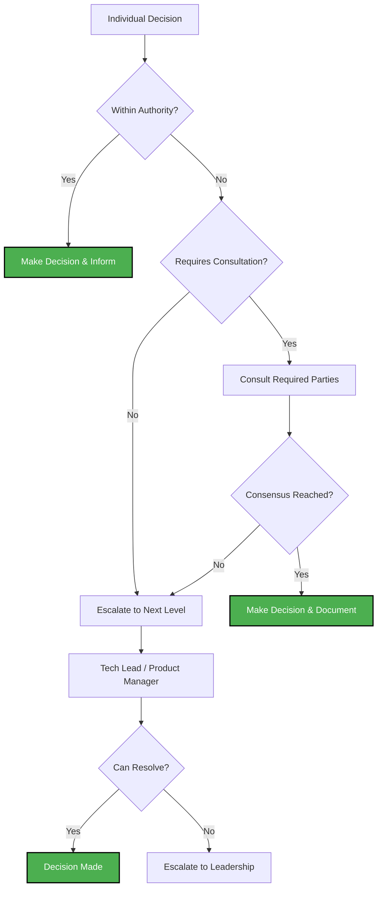

# Decision Authority Matrix: Empowering Teams Within Boundaries

## Overview

Clear decision boundaries enable autonomy while maintaining alignment. This matrix defines who has authority for different types of decisions, reducing bottlenecks and empowering teams to move quickly on tactical choices.

## Authority Levels Defined

- **✅ Decide**: Has full authority to make the decision
- **🤝 Co-lead**: Shares decision-making authority, must collaborate
- **💬 Consult**: Must be consulted before decision is made
- **📢 Inform**: Must be informed after decision is made
- **❌ No Role**: Not involved in this decision type

## Complete Decision Authority Matrix

### Technical Implementation Decisions

| Decision Type | Junior Dev | Senior Dev | Tech Lead | Product Manager | QA Analyst | Designer |
|---------------|------------|------------|-----------|-----------------|------------|----------|
| **Code Architecture** | ❌ | 💬 | ✅ | 📢 | 📢 | ❌ |
| **Technology Stack** | ❌ | 💬 | ✅ | 💬 | 💬 | ❌ |
| **Database Schema** | ❌ | 💬 | ✅ | 💬 | 💬 | ❌ |
| **API Design** | ❌ | 💬 | ✅ | 💬 | 💬 | 💬 |
| **Performance Optimization** | 💬 | ✅ | 🤝 | 📢 | 💬 | ❌ |
| **Security Implementation** | ❌ | 💬 | ✅ | 💬 | 💬 | ❌ |
| **Third-party Integrations** | ❌ | 💬 | ✅ | 💬 | 💬 | ❌ |
| **Deployment Strategy** | ❌ | 💬 | ✅ | 📢 | 💬 | ❌ |

### User Interface & Experience Decisions

| Decision Type | Junior Dev | Senior Dev | Tech Lead | Product Manager | QA Analyst | Designer |
|---------------|------------|------------|-----------|-----------------|------------|----------|
| **Visual Design** | ❌ | 💬 | 💬 | 💬 | 💬 | ✅ |
| **User Flow** | ❌ | 💬 | 💬 | 🤝 | 💬 | 🤝 |
| **Button Placement** | ❌ | ✅ | ✅ | 💬 | 💬 | ✅ |
| **Form Validation** | 💬 | ✅ | 💬 | 💬 | 🤝 | 💬 |
| **Error Messages** | 💬 | ✅ | 💬 | 💬 | 🤝 | 💬 |
| **Loading States** | 💬 | ✅ | 💬 | 💬 | 💬 | ✅ |
| **Responsive Behavior** | 💬 | ✅ | 💬 | 💬 | 💬 | ✅ |
| **Accessibility Features** | 💬 | 💬 | 💬 | 💬 | 🤝 | 🤝 |

### Product & Business Decisions

| Decision Type | Junior Dev | Senior Dev | Tech Lead | Product Manager | QA Analyst | Designer |
|---------------|------------|------------|-----------|-----------------|------------|----------|
| **Feature Scope** | ❌ | 💬 | 💬 | ✅ | 💬 | 💬 |
| **User Stories** | ❌ | 💬 | 💬 | ✅ | 💬 | 💬 |
| **Business Logic** | ❌ | 💬 | 💬 | ✅ | 💬 | ❌ |
| **Acceptance Criteria** | ❌ | 💬 | 💬 | 🤝 | 🤝 | 💬 |
| **Priority Changes** | ❌ | 📢 | 💬 | ✅ | 📢 | 📢 |
| **Release Timing** | ❌ | 💬 | 💬 | ✅ | 💬 | 📢 |
| **Feature Flags** | ❌ | 💬 | 🤝 | 🤝 | 💬 | ❌ |
| **A/B Test Design** | ❌ | 💬 | 💬 | ✅ | 💬 | 💬 |

### Quality & Testing Decisions

| Decision Type | Junior Dev | Senior Dev | Tech Lead | Product Manager | QA Analyst | Designer |
|---------------|------------|------------|-----------|-----------------|------------|----------|
| **Quality Criteria** | ❌ | 💬 | 💬 | 💬 | ✅ | 💬 |
| **Test Strategy** | 💬 | 💬 | 🤝 | 💬 | ✅ | ❌ |
| **Bug Severity** | 💬 | 💬 | 💬 | 💬 | ✅ | ❌ |
| **Release Readiness** | ❌ | 💬 | 🤝 | 💬 | ✅ | ❌ |
| **Performance Benchmarks** | ❌ | 💬 | 🤝 | 💬 | ✅ | ❌ |
| **Automation Coverage** | 💬 | 💬 | 🤝 | ❌ | ✅ | ❌ |
| **Risk Assessment** | 💬 | 💬 | 🤝 | 💬 | ✅ | ❌ |
| **Quality Gates** | ❌ | 💬 | 💬 | 💬 | ✅ | ❌ |

### Process & Workflow Decisions

| Decision Type | Junior Dev | Senior Dev | Tech Lead | Product Manager | QA Analyst | Designer |
|---------------|------------|------------|-----------|-----------------|------------|----------|
| **Sprint Planning** | 💬 | 💬 | 🤝 | 🤝 | 💬 | 💬 |
| **Task Breakdown** | 💬 | ✅ | 🤝 | 💬 | 💬 | 💬 |
| **Estimation** | 💬 | ✅ | 🤝 | 💬 | 💬 | 💬 |
| **Definition of Done** | 💬 | 💬 | 🤝 | 💬 | 🤝 | 💬 |
| **Retrospective Actions** | ✅ | ✅ | ✅ | ✅ | ✅ | ✅ |
| **Team Ceremonies** | 💬 | 💬 | ✅ | 💬 | 💬 | 💬 |
| **Communication Protocols** | 💬 | 💬 | ✅ | 💬 | 💬 | 💬 |
| **Documentation Standards** | 💬 | 💬 | ✅ | 💬 | 💬 | 💬 |

## Decision Escalation Framework

### When to Escalate

**Immediate Escalation Required:**
- Decisions affecting multiple teams
- Budget implications > $10K
- Security or compliance concerns
- Architectural changes affecting system stability

**Consultation Required:**
- Decisions outside your authority level
- Uncertain about decision boundaries
- Potential impact on other team members
- Customer-facing changes

**No Escalation Needed:**
- Decisions within your authority
- Tactical implementation choices
- Process improvements within team
- Individual productivity optimizations

### Escalation Paths



## Role-Specific Decision Guidelines

### Junior Developer Authority
**Can Decide:**
- Code implementation details within assigned tasks
- Personal productivity tools and methods
- Learning and development activities
- Participation in team ceremonies

**Must Consult:**
- Technical approaches affecting other components
- Changes to shared code or interfaces
- Estimation for complex tasks
- Quality and testing approaches

### Senior Developer Authority
**Can Decide:**
- Technical implementation approaches
- Code architecture within feature scope
- Performance optimization strategies
- UI/UX implementation details
- Task breakdown and estimation

**Must Consult:**
- System-wide architectural changes
- Technology stack modifications
- Cross-team integration approaches
- Business logic interpretation

### Tech Lead Authority
**Can Decide:**
- Technical architecture and design
- Technology stack choices
- Development process and standards
- Team technical practices
- Code review standards

**Must Consult:**
- Product scope and priority changes
- Resource allocation decisions
- Cross-functional process changes
- Major architectural shifts

### Product Manager Authority
**Can Decide:**
- Feature scope and requirements
- User story definition and priority
- Business logic and rules
- Release timing and strategy
- Customer communication

**Must Consult:**
- Technical feasibility and complexity
- Resource and timeline implications
- Quality criteria and standards
- Design and user experience decisions

### QA Analyst Authority
**Can Decide:**
- Quality criteria and standards
- Test strategy and approach
- Bug severity and priority
- Release readiness assessment
- Risk assessment and mitigation

**Must Consult:**
- Feature scope changes affecting quality
- Resource allocation for testing
- Process changes affecting quality
- Customer-facing quality decisions

## Decision Documentation

### Required Documentation

**High-Impact Decisions:**
- Decision made and rationale
- Alternatives considered
- Stakeholders consulted
- Implementation timeline
- Success criteria

**Medium-Impact Decisions:**
- Decision made and brief rationale
- Key stakeholders informed
- Implementation approach

**Low-Impact Decisions:**
- Decision logged in team communication
- Brief context if needed

### Decision Log Template

```markdown
## Decision: [Brief Title]
**Date:** [YYYY-MM-DD]
**Decision Maker:** [Name/Role]
**Authority Level:** [Decide/Co-lead/Consult]

### Context
[Brief description of situation requiring decision]

### Decision
[What was decided]

### Rationale
[Why this decision was made]

### Alternatives Considered
[Other options that were evaluated]

### Stakeholders
- **Consulted:** [Names/roles]
- **Informed:** [Names/roles]

### Implementation
[How and when decision will be implemented]

### Success Criteria
[How we'll know if this was the right decision]
```

## Common Decision Scenarios

### Scenario 1: UI Component Implementation
**Situation:** Developer needs to implement a new form component
**Authority:** Senior Developer can decide implementation approach
**Required Consultation:** Designer for visual specifications, QA for validation approach
**Documentation:** Brief implementation notes in code comments

### Scenario 2: Database Schema Change
**Situation:** Feature requires new database tables
**Authority:** Tech Lead decides schema design
**Required Consultation:** Product Manager for business requirements, QA for testing implications
**Documentation:** Schema change documentation and migration plan

### Scenario 3: Feature Scope Adjustment
**Situation:** Technical complexity discovered during implementation
**Authority:** Product Manager decides scope changes
**Required Consultation:** Tech Lead for technical implications, QA for quality impact
**Documentation:** Updated requirements and impact assessment

### Scenario 4: Quality Standards Definition
**Situation:** New feature type requires quality criteria
**Authority:** QA Analyst defines quality standards
**Required Consultation:** Product Manager for business requirements, Tech Lead for technical feasibility
**Documentation:** Quality criteria added to team standards

## Implementation Tips

### Getting Started
1. **Print and Post**: Make matrix visible to entire team
2. **Practice Scenarios**: Walk through common decisions as team
3. **Start Small**: Begin with low-risk decisions to build confidence
4. **Regular Review**: Adjust matrix based on real-world usage

### Common Pitfalls to Avoid
- **Over-consulting**: Don't consult when you have clear authority
- **Under-consulting**: Don't skip required consultations to save time
- **Authority Creep**: Don't expand your authority without team agreement
- **Decision Paralysis**: Don't avoid decisions due to unclear boundaries

---

*[← Back to main analysis](task-breakdown-system-analysis.md)*
