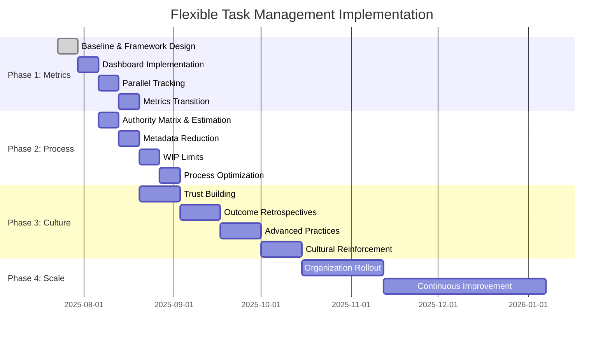

# Implementation Playbook: Transforming to Flexible Task Management

## Critical Success Factors

Before beginning implementation, ensure these conditions are met:

✅ **Leadership Alignment**: Management committed to outcome-based metrics  
✅ **Pilot Team Selected**: Choose team with senior developers and supportive product manager  
✅ **Baseline Metrics**: Current ticket count, cycle time, and satisfaction scores documented  
✅ **Change Champions**: Identify advocates in each role (dev, QA, product)  

## Phase 1: Metrics Revolution (Weeks 1-4)

### Week 1: Baseline and Framework Design

**Day 1-2: Establish Current State**
- Document current ticket count metrics
- Measure time spent on ticket administration
- Survey team satisfaction with current process
- Identify 2-3 business outcomes to track

**Day 3-5: Design New Metrics Framework**
- Define business value measurement criteria
- Create outcome tracking dashboard mockup
- Establish story point velocity with confidence intervals
- Design value delivery tracking system

### Week 2: Dashboard Implementation

**Technical Setup:**
- Implement business outcome tracking dashboard
- Configure story point velocity with ranges
- Set up automated ticket metadata reduction
- Create confidence interval reporting

**Team Training:**
- Train teams on new metrics interpretation
- Practice estimating with ranges instead of fixed points
- Workshop on identifying business outcomes

### Week 3: Parallel Tracking

**Dual Metrics Period:**
- Run old and new metrics side-by-side
- Compare ticket count vs. outcome achievement
- Gather feedback on new dashboard usability
- Refine outcome definitions based on usage

### Week 4: Metrics Transition

**Full Transition:**
- Switch primary reporting to outcome-based metrics
- Maintain ticket count as secondary metric
- Conduct retrospective on metrics change
- Document lessons learned

## Phase 2: Process Flexibility (Weeks 5-8)

### Week 5: Authority Matrix Implementation

**Decision Rights Clarification:**
- Implement decision authority matrix
- Train teams on new decision boundaries
- Create escalation paths for edge cases
- Establish "decision log" for tracking

**Estimation Range Introduction:**
- Allow "3-5 day" estimates instead of "1 day"
- Train on confidence interval usage
- Practice range-based sprint planning
- Monitor estimation accuracy improvement

### Week 6: Metadata Reduction

**Ticket Template Revision:**
- Reduce required fields from 8-10 to 3-4 essential
- Make detailed fields optional
- Create quick-entry templates
- Train teams on streamlined process

**Progressive Elaboration Training:**
- Workshop on just-in-time analysis
- Practice starting work with high-level understanding
- Learn to elaborate details during implementation
- Establish "elaboration checkpoints"

### Week 7: Work-in-Progress Limits

**WIP Cap Implementation:**
- Establish WIP limits to prevent context switching
- Create visual WIP tracking boards
- Train on pull-based work assignment
- Monitor context switching reduction

### Week 8: Process Optimization

**Refinement Based on Experience:**
- Adjust decision authority based on real usage
- Optimize estimation ranges based on accuracy
- Refine ticket templates based on feedback
- Document new process patterns

## Phase 3: Cultural Transformation (Weeks 9-16)

### Weeks 9-10: Trust Building

**Trust-Based Management Training:**
- Leadership workshop on outcome-focused management
- Train managers on trust-and-verify approaches
- Establish outcome-based check-ins
- Create psychological safety for uncertainty

**Developer Empowerment:**
- Expand tactical decision-making authority
- Create "innovation time" for uncertain exploration
- Establish learning-focused retrospectives
- Celebrate intelligent failures

### Weeks 11-12: Outcome-Focused Retrospectives

**New Retrospective Format:**
- Focus on business outcomes achieved
- Measure learning velocity alongside delivery velocity
- Identify adaptation speed improvements
- Track innovation project success rates

**Feedback Loop Optimization:**
- Implement rapid outcome validation cycles
- Create customer feedback integration
- Establish business impact measurement
- Build continuous improvement processes

### Weeks 13-14: Advanced Practices

**Progressive Elaboration Mastery:**
- Advanced training on uncertainty management
- Practice with high-uncertainty projects
- Develop risk-based planning techniques
- Create uncertainty communication frameworks

**Innovation Track Implementation:**
- Establish separate rules for innovation work
- Create innovation success metrics
- Build innovation project pipeline
- Train teams on innovation methodologies

### Weeks 15-16: Cultural Reinforcement

**Recognition and Rewards Alignment:**
- Align performance reviews with new metrics
- Celebrate outcome achievement over process compliance
- Recognize learning and adaptation
- Share success stories across organization

## Implementation Timeline Visualization

## Risk Mitigation Strategies

### High-Risk Scenarios and Responses

**Risk: Management reverts to control measures under pressure**
- **Mitigation**: Establish outcome-based success stories early
- **Response Plan**: Create executive dashboard showing business impact
- **Escalation**: Have change champions ready with data

**Risk: Teams struggle with increased autonomy**
- **Mitigation**: Gradual authority transfer with coaching
- **Response Plan**: Provide decision-making frameworks and support
- **Escalation**: Temporary return to structured approach for struggling individuals

**Risk: Quality concerns arise from looser specifications**
- **Mitigation**: Implement continuous quality validation
- **Response Plan**: Focus on outcome-based quality metrics
- **Escalation**: Enhanced QA partnership and risk-based testing

**Risk: Estimation accuracy decreases initially**
- **Mitigation**: Expect and communicate initial accuracy dip
- **Response Plan**: Focus on confidence intervals and learning
- **Escalation**: Provide additional estimation training

## Success Measurement Framework

### Leading Indicators (Measured Weekly)

**Process Efficiency:**
- Time spent on ticket administration (target: 50% reduction)
- Context switching frequency (target: 60% reduction)
- Decision-making speed (target: 40% improvement)

**Team Satisfaction:**
- Developer autonomy satisfaction (target: 30% improvement)
- Product team strategic focus time (target: 40% increase)
- QA partnership satisfaction (target: 25% improvement)

### Lagging Indicators (Measured Monthly)

**Business Outcomes:**
- Time-to-market for new features (target: 25% improvement)
- Customer satisfaction with delivered solutions (target: 20% improvement)
- Business outcome achievement rate (target: 80% of defined outcomes met)

**Technical Health:**
- Technical debt accumulation rate (target: 30% reduction)
- Estimation accuracy with confidence intervals (target: 90% within range)
- Innovation project success rate (target: 60% of innovation projects deliver value)

## Pilot Team Selection Criteria

### Ideal Pilot Team Characteristics

**Team Composition:**
- 1-2 Senior developers comfortable with ambiguity
- 1 Product manager aligned with outcome-based approach
- 1 QA analyst interested in partnership model
- 1 Tech lead supportive of distributed decision-making

**Project Characteristics:**
- Medium complexity with some uncertainty
- Clear business outcomes measurable within 4-6 weeks
- Not mission-critical (allows for learning and adjustment)
- Visible enough to demonstrate success to organization

## Training Materials and Resources

### Week 1 Training Package
- **Outcome-Based Metrics Workshop** (2 hours)
- **Estimation with Confidence Intervals** (1 hour)
- **Business Value Identification** (1 hour)

### Week 5 Training Package
- **Decision Authority Matrix Workshop** (2 hours)
- **Progressive Elaboration Techniques** (2 hours)
- **WIP Limits and Pull Systems** (1 hour)

### Week 9 Training Package
- **Trust-Based Management** (3 hours, leadership only)
- **Innovation Methodologies** (2 hours)
- **Outcome-Focused Retrospectives** (1 hour)

## Communication Plan

### Stakeholder Communication Schedule

**Weekly Updates:**
- Pilot team progress and learnings
- Metric improvements and challenges
- Success stories and case studies

**Bi-weekly Leadership Updates:**
- Business impact measurements
- Risk assessment and mitigation status
- Scaling readiness assessment

**Monthly Organization Updates:**
- Transformation progress overview
- Success metrics and improvements
- Next phase preparation

## Scaling Strategy

### Organization Rollout Approach

**Phase 4: Selective Scaling (Weeks 17-20)**
- Identify 2-3 additional teams based on pilot success
- Replicate successful practices with local adaptation
- Maintain pilot team as coaching resource
- Continue measuring and refining

**Phase 5: Broad Adoption (Weeks 21-36)**
- Roll out to remaining teams in waves
- Establish center of excellence for ongoing support
- Create internal certification program
- Build continuous improvement culture

---

*[← Back to main analysis](task-breakdown-system-analysis.md)*
