# QA Role Evolution: From Gatekeeper to Quality Partner

## Overview

The shift to flexible task management fundamentally changes how QA operates. Instead of testing against rigid specifications, QA becomes a proactive partner in defining and achieving quality outcomes.

## Current vs. Future QA Role

### Current QA Role in Rigid System
- **Reactive Testing**: QA receives fully-defined tickets with predetermined acceptance criteria
- **Binary Validation**: Pass/fail testing against rigid specifications
- **End-of-Pipeline**: Quality checks happen after development is "complete"
- **Limited Influence**: QA has little input on quality definitions or risk assessment

### Enhanced QA Role in Flexible System
- **Proactive Quality Definition**: QA helps define "done" criteria during progressive elaboration
- **Risk-Based Testing**: Focus testing efforts on highest-risk areas identified during development
- **Continuous Quality Partnership**: Embedded in development process, not just at the end
- **Quality Advocacy**: Represents user experience and system reliability concerns

## QA's New Responsibilities

### 1. Dynamic Quality Criteria Definition

```mermaid
graph LR
    A[Epic/Story Kickoff] --> B[QA Defines Quality Framework]
    B --> C[Progressive Elaboration]
    C --> D[QA Refines Acceptance Criteria]
    D --> E[Development & Testing]
    E --> F[QA Validates Against Evolved Criteria]
    F --> G[Outcome Assessment]
    
    style B fill:#4caf50,stroke:#000,stroke-width:2px,color:#fff
    style D fill:#4caf50,stroke:#000,stroke-width:2px,color:#fff
    style F fill:#4caf50,stroke:#000,stroke-width:2px,color:#fff
```

### 2. Risk-Based Test Strategy
- **High-Risk Areas**: Focus testing on complex integrations, user-facing features, data integrity
- **Low-Risk Areas**: Automated testing for well-understood functionality
- **Emerging Risks**: Identify new risks as requirements evolve during development

### 3. Quality Metrics Evolution
- **From**: "All test cases passed"
- **To**: "User experience meets quality standards and business outcomes achieved"

## QA Integration Points in Flexible Process

### Sprint Planning Phase
- **QA Input**: Risk assessment of proposed work
- **Quality Framework**: Establish quality criteria for outcomes, not just outputs
- **Testing Strategy**: Define approach based on uncertainty level and business impact

### Daily Development
- **Continuous Consultation**: Available for quality questions as requirements evolve
- **Progressive Testing**: Test emerging functionality against evolving criteria
- **Risk Monitoring**: Flag quality concerns as they emerge

### Outcome Validation
- **Business Impact Testing**: Validate that outcomes meet business goals
- **User Experience Validation**: Ensure quality from user perspective
- **System Reliability**: Confirm technical quality standards maintained

## Quality Criteria Framework

### Outcome-Based Quality Metrics

**1. User Experience Quality**
- Task completion rates
- User satisfaction scores
- Error recovery effectiveness

**2. Business Impact Quality**
- Feature adoption rates
- Performance against business KPIs
- Customer support ticket reduction

**3. Technical Quality**
- System performance under load
- Integration reliability
- Maintainability metrics

**4. Process Quality**
- Time to identify and fix issues
- Deployment success rates
- Rollback frequency

## QA Tools and Techniques for Flexible Requirements

### Progressive Acceptance Criteria
- **Initial Framework**: High-level quality expectations
- **Iterative Refinement**: Criteria evolve as understanding deepens
- **Outcome Validation**: Final criteria focus on business and user outcomes

### Risk-Based Testing Matrix

| Risk Level | Testing Approach | QA Involvement | Automation Level |
|------------|------------------|----------------|------------------|
| High | Comprehensive manual + automated | Deep partnership | Medium |
| Medium | Targeted testing on key paths | Regular consultation | High |
| Low | Primarily automated | Minimal oversight | Very High |

### Quality Gates for Flexible Development

1. **Quality Framework Gate**: Are quality criteria defined for the outcome?
2. **Risk Assessment Gate**: Are major risks identified and testing planned?
3. **Progressive Validation Gate**: Is quality being validated throughout development?
4. **Outcome Achievement Gate**: Does the result meet business and user quality standards?

## Addressing QA Concerns About Looser Requirements

### Concern: "How can we test effectively without detailed specifications?"

**Solution**: 
- Shift from specification testing to outcome testing
- Use exploratory testing techniques for uncertain areas
- Develop quality criteria collaboratively as understanding emerges

### Concern: "Quality might suffer with less upfront planning"

**Solution**:
- Implement continuous quality validation instead of end-stage testing
- Focus testing efforts on highest-risk, highest-impact areas
- Use quality metrics that measure actual user and business outcomes

### Concern: "How do we maintain consistency across features?"

**Solution**:
- Establish quality frameworks and patterns that can be applied flexibly
- Create reusable quality criteria templates for common scenarios
- Maintain quality standards documentation that evolves with the product

## QA Decision Authority in New System

| Decision Type | QA Authority | Collaboration Required |
|---------------|--------------|----------------------|
| Quality criteria definition | ✅ Lead | Product Manager, Tech Lead |
| Risk assessment | ✅ Lead | Development Team |
| Testing strategy | ✅ Lead | Tech Lead |
| Acceptance criteria | ✅ Co-lead | Product Manager |
| Release readiness | ✅ Lead | Tech Lead, Product Manager |
| Quality standards | ✅ Lead | Development Team |

## QA Success Metrics in New System

### Leading Indicators
- Time from quality issue identification to resolution
- Percentage of quality criteria defined collaboratively vs. imposed
- QA involvement in early-stage requirement discussions

### Lagging Indicators
- User-reported quality issues (should decrease)
- Business outcome achievement rates (should increase)
- Customer satisfaction with delivered features (should improve)

## Implementation Guide for QA Teams

### Week 1-2: Framework Development
- Define outcome-based quality criteria templates
- Establish risk assessment methodologies
- Create quality gate checklists

### Week 3-4: Process Integration
- Train on progressive elaboration techniques
- Practice collaborative criteria definition
- Implement risk-based testing approaches

### Week 5-8: Continuous Improvement
- Refine quality frameworks based on experience
- Optimize testing strategies for different risk levels
- Build quality metrics dashboards

## Common QA Scenarios in Flexible System

### Scenario 1: Feature with Uncertain Requirements
**Traditional Approach**: Wait for complete specifications
**New Approach**: Define quality framework, test progressively as requirements emerge

### Scenario 2: Innovation Project with High Uncertainty
**Traditional Approach**: Reject due to inability to define test cases
**New Approach**: Focus on outcome quality, use exploratory testing extensively

### Scenario 3: Bug Fix with Unclear Root Cause
**Traditional Approach**: Test specific fix against predetermined criteria
**New Approach**: Validate that user problem is solved, regardless of implementation approach

---

*[← Back to main analysis](task-breakdown-system-analysis.md)*
